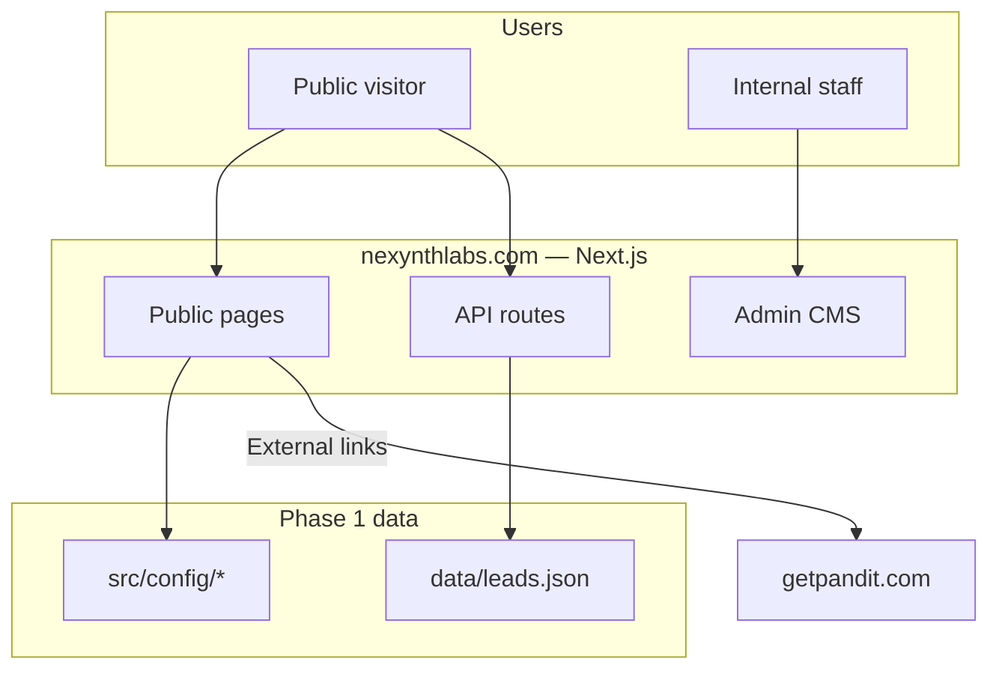
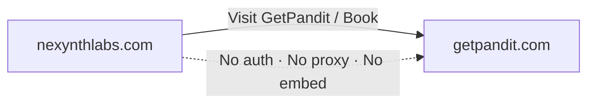
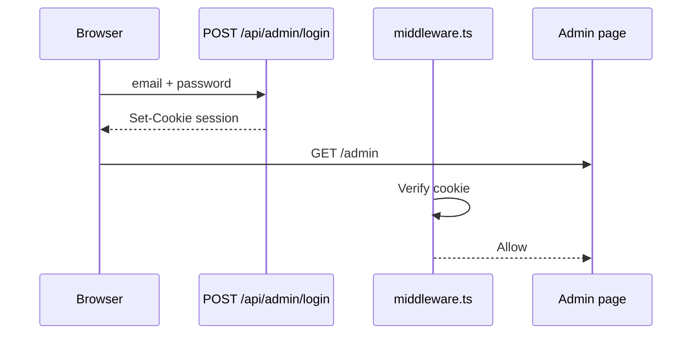

# Architecture Document — Nexynth Labs Website

**Version:** 2.0  
**Last updated:** June 2026

> **Diagrams:** All Mermaid architecture diagrams are in [10-architecture-diagrams.md](./10-architecture-diagrams.md) (GitHub-renderable).

---

## 1. Executive summary

The Nexynth Labs corporate website is a **standalone Next.js application** intentionally decoupled from the GetPandit product. Marketing content, lead capture, and internal CMS previews run on `nexynthlabs.com`; product transactions run on `getpandit.com`.

Design goals:

1. **Static-first** — Maximize cacheable public pages; minimize runtime dependencies.
2. **Config-driven** — Content in version-controlled TypeScript config until CMS phase 2.
3. **CMS-ready** — Admin shell, roles, and types exist before database integration.
4. **No public auth** — Visitors browse and enquire only.

---

## 2. High-level architecture

See **[Diagram 1 — Website architecture](./10-architecture-diagrams.md#1-website-architecture)**.



---

## 3. Layered architecture

| Layer | Location | Responsibility |
| --- | --- | --- |
| **Presentation** | `src/app/(site)/`, `src/components/` | Pages, layout, UI components |
| **Admin presentation** | `src/app/admin/`, `src/components/admin/` | CMS dashboard, leads UI |
| **API** | `src/app/api/` | Enquiry intake, admin auth, leads CRUD |
| **Domain / config** | `src/config/` | Business content, CMS module definitions |
| **Infrastructure** | `src/lib/`, `src/middleware.ts` | Auth, SEO, lead storage, session |
| **Types** | `src/types/` | Contracts for leads, CMS, future content |

---

## 4. Routing architecture

### 4.1 Route groups

| Group | Path prefix | Layout |
| --- | --- | --- |
| Public site | `src/app/(site)/` | Header + Footer + JSON-LD |
| Admin | `src/app/admin/` | AdminShell (no public header) |
| Root | `src/app/layout.tsx` | HTML shell, fonts, viewport |

The `(site)` group name does not appear in URLs.

### 4.2 Website page flow

See **[Diagram 2 — Page and navigation flow](./10-architecture-diagrams.md#2-page-and-navigation-flow)** for the full navigation map.

### 4.3 Public routes

| Route | Rendering | Data source |
| --- | --- | --- |
| `/` | Static | `site.ts`, `services.ts`, `products.ts`, `blog.ts` |
| `/about` | Static | `about.ts`, `site.ts` |
| `/company/founder` | Static | `founder-story.ts` |
| `/services` | Static | `services.ts` |
| `/technology` | Static | `technology-excellence.ts` |
| `/roadmap` | Static | `roadmap.ts` |
| `/status` | Static | `status-page.ts` |
| `/security` | Static | `security-trust.ts` |
| `/trust` | Static | `security-trust.ts` |
| `/resources` | Static | `knowledge.ts` |
| `/guides` | Static | `knowledge.ts` |
| `/resources/[slug]` | SSG | `knowledge.ts` |
| `/guides/[slug]` | SSG | `knowledge.ts` |
| `/products` | Static | `products.ts` |
| `/products/ecosystem` | Static | `product-ecosystem.ts` |
| `/getpandit` | Static | `products.ts` |
| `/careers` | Static | `careers.ts` |
| `/blog` | Static | `blog.ts` |
| `/blog/[slug]` | SSG (`generateStaticParams`) | `blog.ts` |
| `/contact` | Static + client form | `site.ts`, `contact.ts` |
| `/request-proposal` | Static + client form | `request-proposal.ts` |
| `/book-consultation` | Static + client form | `book-consultation.ts` |
| `/ai-readiness-score` | Static + client form | `ai-readiness-score.ts` |
| `/partners` | Static + client form | `partners.ts` |
| `/partners/portal` | Static + client form | `partner-portal.ts` |
| `/portfolio` | Static | `portfolio.ts` |
| `/case-studies` | Static | `portfolio.ts` |
| `/case-studies/[slug]` | SSG | `portfolio.ts` |
| `/client-success` | Static | `client-success.ts` |
| `/innovation-lab` | Static | `innovation-lab.ts` |
| `/ai-showcase` | Static | `ai-showcase.ts` |
| `/events` | Static | `events.ts` |
| `/testimonials` | Static | `testimonials.ts` |
| `/faq` | Static + client search | `faqs.ts` |
| `/media-kit` | Static | `media-kit.ts` |
| `/developers` | Static | `developers.ts` |
| `/leadership` | Static | `leadership.ts` |
| `/leadership/[slug]` | SSG | `leadership.ts` |
| `/company/leadership` | Redirect | → `/leadership` |
| `/company/vision` | Static | `company-vision.ts` |
| `/careers/culture` | Static | `careers-culture.ts` |
| Legal pages | Static | `legal.ts` |

**Cross-cutting (all public pages):**

| Concern | Implementation |
| --- | --- |
| i18n shell | `LocaleProvider`, `LanguageSwitcher`, `src/messages/{en,te,hi}.ts` |
| AI assistant | `AiAssistantWidget` in site layout — placeholder only |
| Analytics | `trackPlannedEvent()` — env-gated; no scripts until consent + IDs |
| SEO | `createPageMetadataFromKey()`, sitemap, JSON-LD in site layout |

### 4.4 System routes

| Route | Generator |
| --- | --- |
| `/sitemap.xml` | `src/app/sitemap.ts` |
| `/robots.txt` | `src/app/robots.ts` |
| `/opengraph-image` | `src/app/opengraph-image.tsx` (edge) |
| `/twitter-image` | `src/app/twitter-image.tsx` (edge) |

### 4.5 Admin routes

| Route | Access |
| --- | --- |
| `/admin/login` | Public (redirects if authenticated) |
| `/admin` | Authenticated |
| `/admin/[module]` | Authenticated + role module read |
| `/admin/leads` | Special-cased leads view |

---

## 5. GetPandit boundary

See **[Diagram 7 — GetPandit product ecosystem flow](./10-architecture-diagrams.md#7-getpandit-product-ecosystem-flow)**.



**Rules enforced in architecture:**

- Product `href` and `bookingHref` in `products.ts` point to `getpandit.com`.
- Corporate `/getpandit` is marketing-only.
- Legal policies state separate product terms/privacy.
- Footer links to GetPandit app as external `target="_blank"`.

---

## 6. Content flow (phase 1)

```
Developer edits src/config/*.ts
        ↓
    git commit
        ↓
    npm run build
        ↓
    Deploy → static pages reflect config
```

**Phase 2 target:** See **[Diagram 5 — Future CMS flow](./10-architecture-diagrams.md#5-future-cms-flow)**.

---

## 7. Lead capture flow

See **[Diagram 3 — Lead and RFP flow](./10-architecture-diagrams.md#3-lead-and-rfp-flow)**.

---

## 8. Authentication and Admin CMS flow

See **[Diagram 5 — Future CMS flow](./10-architecture-diagrams.md#5-future-cms-flow)** for the database-backed target. **Today:** read-only module previews except leads inbox — see [Admin User Guide](./04-admin-user-guide.md).



**Edge vs Node split:** Middleware uses `auth-edge.ts` (no Node `crypto`). Full signature verification on API routes uses `auth.ts`.

---

## 9. CMS module architecture

| Module ID | Config source | Phase 1 UI |
| --- | --- | --- |
| `company-profile` | `site.ts` | Read-only preview |
| `services` | `services.ts` | Read-only preview |
| `products` | `products.ts` | Read-only preview |
| `blogs` | `blog.ts` | Read-only preview |
| `faqs` | `faqs.ts` | Stub |
| `testimonials` | `testimonials.ts` | Stub |
| `seo` | `site.ts → seo` | Read-only preview |
| `careers` | `careers.ts` | Read-only preview |
| `leads` | `data/leads.json` | Interactive table |

Permissions matrix: `CMS_ROLE_PERMISSIONS` in `src/config/cms.ts`.

---

## 10. Integration architecture

Third-party services (analytics, CRM, messaging, payments) are defined as **configurable placeholders** — no provider SDKs or scripts are loaded in phase 1.

| Layer | Path | Role |
| --- | --- | --- |
| Types | `src/types/integrations.ts` | `IntegrationId`, lifecycle, resolved state |
| Registry | `src/config/integrations.ts` | Metadata, env var catalog, scopes |
| Resolver | `src/lib/integrations/env.ts` | Merge registry + `process.env` |
| Stubs | `src/lib/integrations/{crm,messaging,payments}.ts` | Typed no-op adapters for future wiring |

**Lifecycle:** `disabled` → `configured` (env present) → `active` (`INTEGRATIONS_*_STATUS=active` + adapter implemented).

**Scopes:**

| Scope | Integrations |
| --- | --- |
| Corporate site | GA4, GTM, Meta Pixel, CRM |
| GetPandit product | Payment gateway, booking SMS/WhatsApp |
| Both | WhatsApp chat link, optional lead SMS |

Analytics event plumbing is documented in **[Diagram 4 — Analytics flow](./10-architecture-diagrams.md#4-analytics-flow)**. See **[Integrations Guide](./12-integrations-guide.md)** and **[Diagram 6 — Future WhatsApp, SMS, and Payment flow](./10-architecture-diagrams.md#6-future-whatsapp-sms-and-payment-flow)**.

---

## 11. Future product integrations

SMS, WhatsApp, and payment gateway **booking flows** are planned on **getpandit.com**. The corporate site holds configuration slots and marketing copy only.

---

## 12. SEO architecture

Injected at layout level:

- **Site layout** (`(site)/layout.tsx`): Organization + WebSite `@graph`
- **Legal pages**: WebPage JSON-LD per document
- **Blog posts**: Article JSON-LD

Metadata pipeline:

```
siteConfig.seo.pages[key]
        ↓
createPageMetadataFromKey(key)
        ↓
PAGE_PATHS[key] → canonical URL
        ↓
Next.js Metadata API → <head> tags
```

---

## 13. Deployment topology

| Environment | Typical host | Notes |
| --- | --- | --- |
| Local | `localhost:3000` | `data/leads.json` on disk |
| Staging | Vercel preview / internal | Separate env secrets |
| Production | Vercel / Netlify / Node | Custom domain, HTTPS |

See [Deployment Guide](./05-deployment-guide.md).

---

## 14. Scalability and limitations (phase 1)

| Limitation | Impact | Phase 2 remedy |
| --- | --- | --- |
| File-based leads | Not suitable for multi-instance serverless without shared storage | PostgreSQL |
| Config-file content | Requires deploy to change copy | CMS + publish pipeline |
| Shared admin password | Not production-grade | Per-user password hashes |
| No CDN cache invalidation API | Full redeploy on content change | ISR / webhooks |

---

## 14. Related documents

- [Architecture Diagrams](./10-architecture-diagrams.md) — all Mermaid diagrams
- [Technical Specification](./02-technical-specification.md)
- [Functional Specification](./01-functional-specification.md)
- [Future Roadmap](./08-future-roadmap.md)
