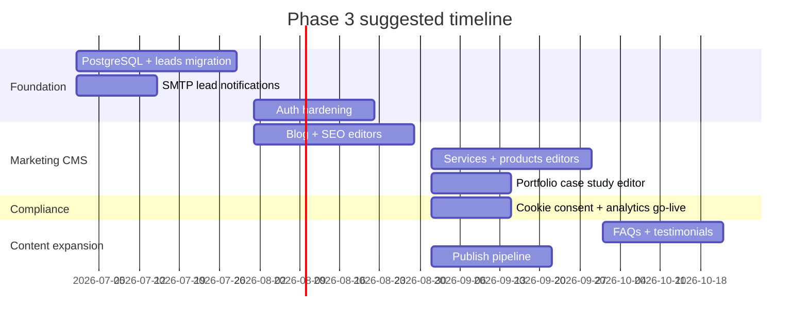

# Future Roadmap — Nexynth Labs Website

**Version:** 2.0  
**Last updated:** June 2026

This roadmap covers planned evolution of the Nexynth Labs **corporate website** only. GetPandit product roadmap is maintained separately on the product repository.

---

## Phase summary

| Phase | Focus | Status |
| --- | --- | --- |
| **Phase 1** | Public site, config-driven content, admin shell, contact leads | **Complete** |
| **Phase 2** | Portfolio, AI showcase, partners, WhatsApp readiness, CRM lite, analytics | **Complete** |
| **Phase 3** | Product ecosystem, founder, technology, roadmap, status, trust, knowledge, lead tools, innovation lab, careers culture, FAQ, media kit, developers, i18n shell, AI assistant placeholder | **Complete** (public features) |
| **Phase 3b** | Database CMS, SMTP leads, module editors, auth hardening | **Next priority** (ops) |
| **Phase 4** | Cookie consent, analytics go-live, full i18n content, live status monitoring, AI assistant API | Future |
| **Ongoing** | Legal review, SEO, performance, mobile QA | Continuous |

---

## Phase 1 — Delivered ✅

### Public website

- [x] Home, About, Services, Products, GetPandit, Careers, Blog, Contact
- [x] Legal pages: Privacy, Terms & Conditions, Cookie Policy, Disclaimer
- [x] Mobile-optimized layout (360px+)
- [x] GetPandit external linking (no product embed)

### SEO & legal readiness

- [x] Dynamic metadata, Open Graph, Twitter cards, canonical URLs
- [x] sitemap.xml, robots.txt, schema.org Organization + WebSite
- [x] Legal draft content with counsel review notice

### Lead capture

- [x] Contact form with service interest dropdown
- [x] `POST /api/enquiry` → `data/leads.json`
- [x] Admin leads table with status workflow

### Admin CMS (structure)

- [x] Role-based access (4 roles, 9 modules)
- [x] Signed session cookies + middleware
- [x] Read-only module previews
- [x] Leads module (interactive)

---

## Phase 2 — Marketing & operations readiness ✅

Delivered June 2026. See [Final QA Report](./11-final-qa-report.md) for verification.

### Portfolio & case studies

- [x] `/portfolio` overview
- [x] `/case-studies` index + `/case-studies/[slug]` detail
- [x] `/client-success` — anonymized success stories (no fake metrics)
- [x] Config-driven case studies (`src/config/portfolio.ts`)
- [x] 301 redirect `/portfolio/:slug` → `/case-studies/:slug`

### AI Showcase

- [x] `/ai-showcase` — automation, agentic use cases, integrations, future ideas
- [x] Nav, SEO, sitemap

### GetPandit success metrics

- [x] Honest readiness indicators (no fake growth numbers)
- [x] On home, `/getpandit`, case study detail

### Investors & partners

- [x] `/partners` — partnership models, investor CTA, partner form
- [x] `source: partner-form` on enquiry API

### WhatsApp Business readiness

- [x] Click-to-chat CTAs on `/contact` and `/partners`
- [x] `POST /api/whatsapp-cta` lead logging
- [x] Integration placeholders (Cloud API, Twilio, Gupshup) — **not wired**
- [x] No floating FAB (by design)

### Lead CRM Lite

- [x] Extended lead model (source, status, notes, sourcePage, interestType)
- [x] Admin status workflow + notes + CSV export
- [x] File backend `data/leads.json`

### Analytics dashboard readiness

- [x] GA, GTM, Meta Pixel, LinkedIn env placeholders
- [x] Conditional scripts + `trackPlannedEvent()` safe no-op
- [x] Six planned events (forms, CTAs, portfolio/case study views)
- [ ] Production tracking IDs — **pending** cookie consent + marketing approval

### Integrations registry

- [x] `src/config/integrations.ts` + guides 12–15

---

## Phase 3 — Public features (delivered June 2026) ✅

See [Phase 3 Final QA Report](./28-phase-3-final-qa-report.md).

### 3.0 Product ecosystem (delivered)

- [x] `/products/ecosystem` — config-driven product line with honest status labels
- [x] GetPandit (Live), AI Agents, Temple Management, Vendor Marketplace, Enterprise Automation, Coming Soon section
- [x] Nav, footer, sitemap, SEO — see [Product Ecosystem Guide](./16-product-ecosystem-guide.md)

### 3.0b Founder story (delivered)

- [x] `/company/founder` — config-driven vision, placeholder founder note, roadmap
- [x] Nav, sitemap, SEO — see [Founder Story Guide](./17-founder-story-guide.md)

### 3.0c Technology excellence (delivered)

- [x] `/technology` — AI, web, mobile, cloud, DevOps, integrations, security capability cards
- [x] Nav, footer, sitemap, SEO — see [Technology Excellence Guide](./18-technology-excellence-guide.md)

### 3.0d Public roadmap (delivered)

- [x] `/roadmap` — interactive timeline with Completed / In Progress / Planned / Future groups
- [x] Nav, sitemap, SEO — see [Public Roadmap Guide](./19-public-roadmap-guide.md)

### 3.0e Status page (delivered)

- [x] `/status` — config-maintained service health placeholders
- [x] Future monitoring TODO — see [Status Page Guide](./20-status-page-guide.md)

### 3.0f Security & trust center (delivered)

- [x] `/security` and `/trust` — config-driven; no false compliance claims
- [x] Footer links — see [Security & Trust Center Guide](./21-security-trust-center-guide.md)

### 3.0g Knowledge center (delivered)

- [x] `/resources` and `/guides` with search/filter and config-driven articles
- [x] See [Knowledge Center Guide](./22-knowledge-center-guide.md)

### 3.0h AI Readiness Score (delivered)

- [x] `/ai-readiness-score` — 10-question lead tool with tier results
- [x] See [AI Readiness Score Guide](./23-ai-readiness-score-guide.md)

### 3.0i Book Free Consultation (delivered)

- [x] `/book-consultation` — topic-based consultation request form
- [x] See [Book Consultation Guide](./24-book-consultation-guide.md)

### 3.0j Partner Portal Readiness (delivered)

- [x] `/partners/portal` — readiness content per partner type; enquiry-only apply flow
- [x] See [Partner Portal Readiness Guide](./25-partner-portal-readiness-guide.md)

### 3.0k Innovation Lab (delivered)

- [x] `/innovation-lab` — R&D sections with concept/prototype/planned/live labels
- [x] See [Innovation Lab Guide](./26-innovation-lab-guide.md)

### 3.0l Careers & Culture (delivered)

- [x] `/careers` enhanced with culture teaser and open roles placeholder mode
- [x] `/careers/culture` — full culture sections
- [x] See [Careers & Culture Guide](./27-careers-culture-guide.md)

---

## Phase 3b — CMS & operations (next priority)

### 3.1 Persistence layer

| Item | Priority | Notes |
| --- | --- | --- |
| PostgreSQL + ORM (Prisma/Drizzle) | P0 | Required for serverless production leads |
| `cms_users` table | P0 | Replace `CMS_DEV_USERS` |
| `cms_leads` table | P0 | Migrate from `data/leads.json` |
| `cms_revisions` table | P1 | Draft/publish content versions |

**Env:** `DATABASE_URL`

### 3.2 Lead operations

| Item | Priority | Notes |
| --- | --- | --- |
| SMTP / Resend integration | P0 | `src/lib/leads/email.ts` |
| Auto-reply to submitter | P2 | Optional template |
| Lead assignment to sales user | P2 | Requires user table |
| External CRM webhook (HubSpot, Zoho) | P2 | Registry placeholder exists |

**Env:** `SMTP_*`, `LEADS_NOTIFY_EMAIL`

### 3.3 Module editors (in-browser)

| Module | Priority |
| --- | --- |
| Leads inbox (enhanced) | P0 |
| Blog editor (MDX/rich text) | P1 |
| SEO per-page editor | P1 |
| Services CRUD + reorder | P1 |
| Products CRUD | P1 |
| Portfolio / case studies CRUD | P1 |
| Company profile form | P2 |
| Careers job CRUD | P2 |
| FAQs CRUD + public `/faqs` page | P2 |
| Testimonials CRUD + home section | P2 |

### 3.4 Auth hardening

| Item | Priority |
| --- | --- |
| Bcrypt/Argon2 password hashes | P0 |
| Per-user passwords (no shared `ADMIN_PASSWORD`) | P0 |
| Rate limiting on `/api/admin/login` | P1 |
| SUPER_ADMIN user management UI | P1 |
| Google Workspace SSO (`@nexynthlabs.com`) | P2 |
| Audit log for admin actions | P2 |

### 3.5 Publish pipeline

| Item | Priority |
| --- | --- |
| Draft vs published (`ContentStatus`) | P1 |
| Admin-only preview URLs | P2 |
| Deploy webhook on publish | P1 |
| ISR `revalidateTag` per module | P2 alternative |

**Env:** `CMS_WEBHOOK_REBUILD_URL`

---

## Phase 4 — Growth & polish

> **Feature catalog & build order:** [Phase 3 Feature Roadmap](./29-phase-3-feature-roadmap.md) §5

### Marketing & content

- [x] `/faq` — searchable help center with FAQPage schema
- [ ] Testimonials on home page → Wave 1
- [ ] Press kit / media page → Wave 1
- [x] `/request-proposal` — RFP form with lead API + mailto fallback
- [ ] RFP document upload → backlog
- [x] `/events` listing — Upcoming, Planned, Completed labels
- [x] Newsletter signup component — Home, Blog, Resources, Footer
- [ ] Developers / integration docs page → Wave 4
- [ ] RSS feed for blog

### Internationalization

- [x] i18n-ready structure — `src/config/i18n.ts`, `src/messages/`, `LocaleProvider` — see [41](./41-multilingual-readiness-guide.md)
- [x] Language switcher (English, Telugu, Hindi labels)
- [ ] Full Telugu (`te_IN`) page content
- [ ] Full Hindi (`hi_IN`) page content
- [ ] `app/[locale]/` routing or middleware prefix
- [ ] Localized SEO metadata and `hreflang`

### Analytics & monitoring

- [ ] Cookie consent banner before production tags
- [ ] Enable GA/GTM/Meta/LinkedIn in production (post-consent)
- [ ] Uptime monitoring
- [ ] Error tracking (Sentry)
- [ ] Core Web Vitals dashboards

### Design & assets

- [ ] Brand photography and illustrations in `public/`
- [ ] Custom favicon and app icons
- [ ] Optional static `og-image.png` fallback

### Legal & compliance

- [ ] **Final legal review** by qualified counsel (required before production reliance)
- [ ] DPDP Act alignment review (India)

---

## Phase 5 — Optional integrations

| Integration | Use case |
| --- | --- |
| WhatsApp Business API (server) | Proactive messaging, templates |
| CRM (HubSpot, Zoho) | Sync leads from enquiry form |
| Headless CMS (Sanity, Contentful) | Alternative to custom CMS |
| Calendly / Cal.com | Sales meeting booking |
| Status page | Service status for corporate clients |

---

## GetPandit — explicitly out of scope

The following remain on **getpandit.com** and are not planned for this corporate repo:

- Pandit booking flows
- Payment gateway
- SMS / WhatsApp notifications
- User accounts and authentication
- Product-specific legal terms

Corporate site will continue to **link externally** only.

---

## Suggested implementation order

---

## Success metrics

| Metric | Target |
| --- | --- |
| Lighthouse Performance (mobile) | ≥ 90 |
| Contact + partner form conversion | Track after analytics go-live |
| Lead response time | < 2 business days |
| Index coverage (Search Console) | All ~54 public sitemap URLs indexed |
| Admin content update time | < 1 hour (post phase 3 editors) |

---

## How to propose changes

1. Open an issue or ticket describing the feature
2. Reference this roadmap phase
3. Update this document when scope is approved

---

## Related documents

- [Final QA Report](./11-final-qa-report.md) — Phase 2 verification
- [Phase 3 Feature Roadmap](./29-phase-3-feature-roadmap.md) — full catalog, checklist, build sequence
- [Phase 3 Final QA Report](./28-phase-3-final-qa-report.md) — Phase 3 verification
- [Final Regression QA Report](./45-final-regression-qa-report.md) — Prompt 26 full regression (16 Jun 2026)
- [CMS phase-3 backlog detail](../cms-todo.md)
- [Functional Specification](./01-functional-specification.md)
- [Architecture Document](./03-architecture.md)
- [Legal review requirements](../legal.md)
