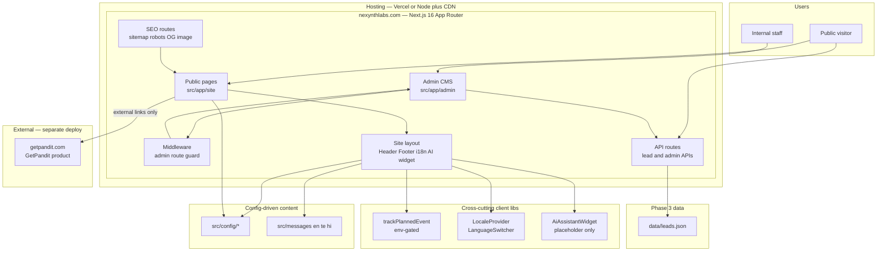
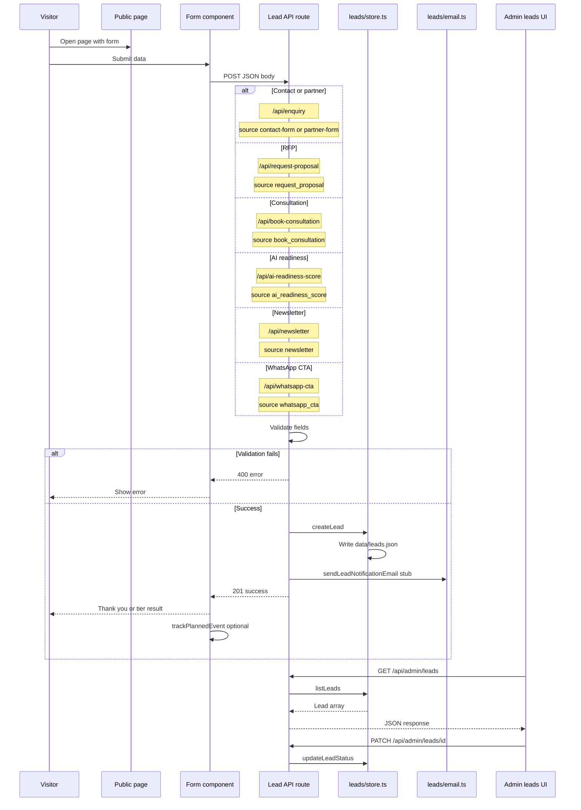
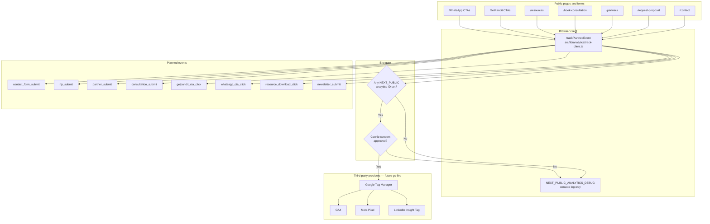
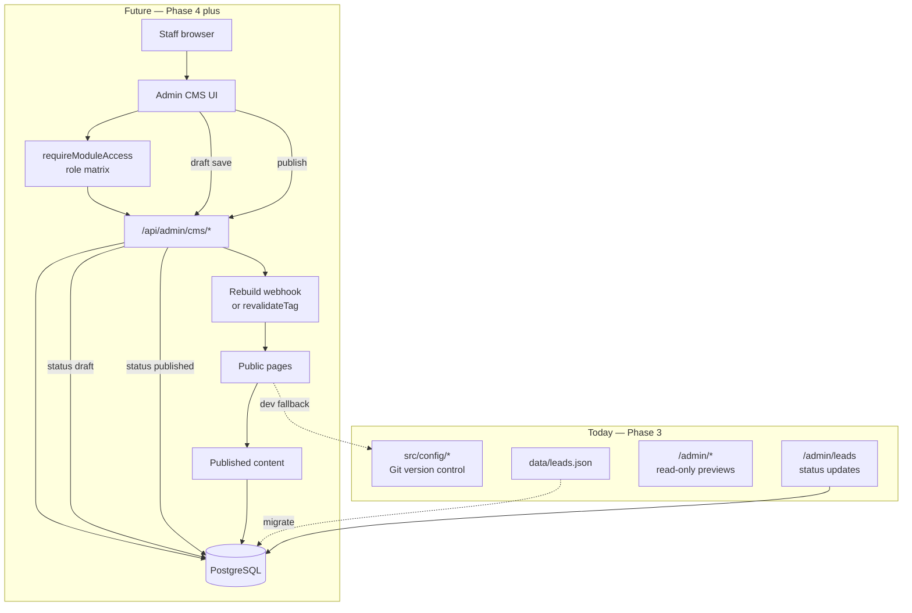
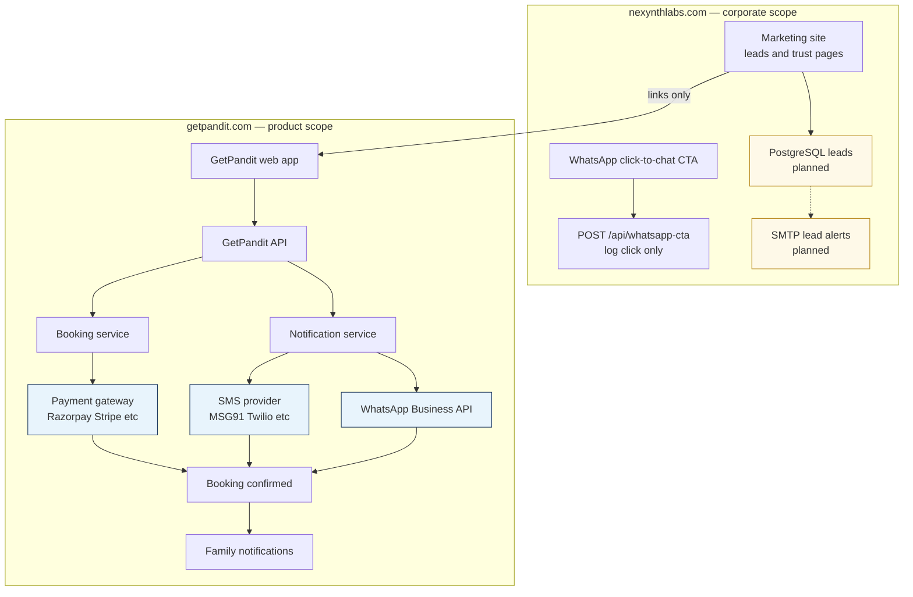
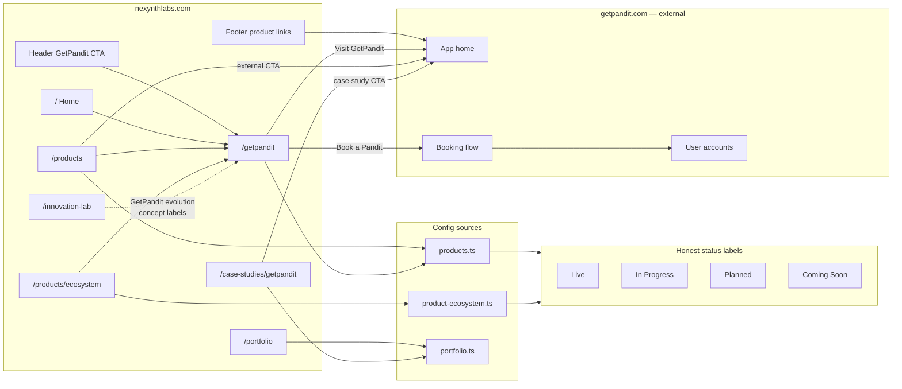

# Architecture Diagrams — Nexynth Labs Website

**Version:** 2.0  
**Last updated:** June 2026  
**Format:** [Mermaid](https://mermaid.js.org/) — renders on GitHub, GitLab, and most Markdown viewers

These diagrams describe the **Nexynth Labs corporate website** (`nexynthlabs.com`). The **GetPandit product** (`getpandit.com`) is a separate application — linked externally, not embedded.

| # | Diagram | Section |
| --- | --- | --- |
| 1 | [Website architecture](#1-website-architecture) | System boundaries and layers |
| 2 | [Page and navigation flow](#2-page-and-navigation-flow) | Public visitor paths |
| 3 | [Lead and RFP flow](#3-lead-and-rfp-flow) | All lead capture APIs |
| 4 | [Analytics flow](#4-analytics-flow) | Env-gated events and providers |
| 5 | [Future CMS flow](#5-future-cms-flow) | Database-backed editing target |
| 6 | [Future WhatsApp, SMS, and Payment flow](#6-future-whatsapp-sms-and-payment-flow) | GetPandit product integrations |
| 7 | [GetPandit product ecosystem flow](#7-getpandit-product-ecosystem-flow) | Corporate marketing to product domain |

**Related:** [Architecture Document](./03-architecture.md) · [Technical Specification](./02-technical-specification.md) · [Phase 3 Feature Deck](./43-phase-3-feature-deck.md)

---

## 1. Website architecture

End-to-end view of visitors, staff, the Next.js app, config data, lead storage, and external GetPandit.

**Key boundaries**

- Corporate site: marketing pages, lead intake, trust surfaces — no product transactions.
- GetPandit booking, payments, and messaging run on `getpandit.com`.
- Admin is session-protected; excluded from `sitemap.xml` and search indexing.
- Analytics scripts load only when public env IDs are set and consent policy allows.

---

## 2. Page and navigation flow

Primary paths from home through Phase 3 routes. Header nav is defined in `src/config/header-navigation.ts` (grouped IA with dropdowns); `siteConfig.navigation.main` is a flattened derivative for legacy consumers. Footer adds knowledge, legal, and lead-tool links.

```mermaid
flowchart TD
  entry(["Visitor arrives"])

  entry --> home["/ Home"]
  entry --> deep["Direct URL\nblog legal contact faq"]

  home --> companyHub["Company hub"]
  home --> services["/services"]
  home --> tech["/technology"]
  home --> ai["/ai-showcase"]
  home --> innov["/innovation-lab"]
  home --> products["/products"]
  home --> proofHub["Proof hub"]
  home --> knowledgeHub["Knowledge hub"]
  home --> leadsHub["Lead tools hub"]
  home --> trustHub["Trust hub"]
  home --> contact["/contact"]

  companyHub --> about

  subgraph companyRoutes["Company routes"]
    about["/about"]
    founder["/company/founder"]
    leadership["/company/leadership"]
    vision["/company/vision"]
    careers["/careers"]
    culture["/careers/culture"]
    roadmap["/roadmap"]
  end

  products --> ecosystem["/products/ecosystem"]
  products --> getpandit["/getpandit"]
  getpandit --> extgp["getpandit.com\nexternal"]

  subgraph proofRoutes["Portfolio and social proof"]
    portfolio["/portfolio"]
    casestudies["/case-studies"]
    clientsuccess["/client-success"]
    testimonials["/testimonials"]
  end

  portfolio --> casestudies
  casestudies --> csdetail["/case-studies/slug"]

  subgraph knowledgeRoutes["Knowledge center"]
    resources["/resources"]
    guides["/guides"]
    blog["/blog"]
    faq["/faq"]
    mediakit["/media-kit"]
    developers["/developers"]
  end

  blog --> article["/blog/slug"]
  resources --> resslug["/resources/slug"]

  subgraph leadRoutes["Conversion routes"]
    rfp["/request-proposal"]
    consult["/book-consultation"]
    aiready["/ai-readiness-score"]
    partners["/partners"]
    portal["/partners/portal"]
    events["/events"]
  end

  subgraph trustRoutes["Trust and status"]
    security["/security"]
    trustctr["/trust"]
    status["/status"]
  end

  services --> contact
  getpandit --> contact
  rfp --> apirfp["POST /api/request-proposal"]
  consult --> apiconsult["POST /api/book-consultation"]
  aiready --> apiai["POST /api/ai-readiness-score"]
  contact --> apienq["POST /api/enquiry"]
  partners --> apienq
  portal --> apienq

  proofHub --> portfolio
  knowledgeHub --> resources
  leadsHub --> rfp
  trustHub --> security

  home --> legalHub
  deep --> legalHub
  subgraph legalRoutes["Legal pages"]
    privacy["/privacy-policy"]
    terms["/terms"]
    cookie["/cookie-policy"]
    disclaimer["/disclaimer"]
  end
```

**Redirects:** `/rfp` to `/request-proposal` · `/press` to `/media-kit` · `/portfolio/slug` to `/case-studies/slug`

**Global widgets:** Language switcher and AI assistant on every public page via site layout.

---

## 3. Lead and RFP flow

All public lead APIs write to `data/leads.json` and appear in `/admin/leads`. SMTP notification remains a stub until `SMTP_*` env vars are configured.

| Route | Page | Lead source |
| --- | --- | --- |
| `POST /api/enquiry` | `/contact`, `/partners`, `/partners/portal` | `contact-form`, `partner-form` |
| `POST /api/request-proposal` | `/request-proposal` | `request_proposal` |
| `POST /api/book-consultation` | `/book-consultation` | `book_consultation` |
| `POST /api/ai-readiness-score` | `/ai-readiness-score` | `ai_readiness_score` |
| `POST /api/newsletter` | Home, Blog, Resources, Footer | `newsletter` |
| `POST /api/whatsapp-cta` | WhatsApp CTAs site-wide | `whatsapp_cta` |

**Phase 4:** PostgreSQL via `DATABASE_URL`; SMTP alerts; optional CRM sync — see [Lead CRM Lite Guide](./14-lead-crm-lite-guide.md).

---

## 4. Analytics flow

Event plumbing ships today; third-party scripts are **env-gated** and should not load until cookie consent and production IDs are approved.

**Config:** `src/config/analytics.ts` · **Guide:** [Analytics Dashboard Guide](./15-analytics-dashboard-guide.md)

**Default behavior:** No network requests to GTM, GA, Meta, or LinkedIn without configured IDs.

---

## 5. Future CMS flow

Target state for database-backed content editing. **Today:** admin modules are read-only previews except the leads inbox (`data/leads.json`).

**Modules (priority):** Leads, company profile, blog, SEO, services, products, FAQs, testimonials, careers — see [Admin and CMS Future Guide](./44-admin-cms-future-guide.md).

---

## 6. Future WhatsApp, SMS, and Payment flow

Planned integrations for **GetPandit** on `getpandit.com`. The corporate site describes readiness in marketing copy and logs WhatsApp CTA clicks only.

| Node style | Meaning |
| --- | --- |
| Blue | GetPandit product integrations — not built in corporate repo |
| Gold | Corporate Phase 4 ops — SMTP and database leads |
| Solid arrows | Implemented or direct dependency |
| Dashed arrows | Planned migration path |

**Registry:** `src/config/integrations.ts` · **Guide:** [Integrations Guide](./12-integrations-guide.md)

---

## 7. GetPandit product ecosystem flow

How corporate pages present the product line and route visitors to `getpandit.com` without embedding the product app.

**Architectural rules**

- No iframe embed, API proxy, or shared auth between domains.
- `href` and `bookingHref` in `src/config/products.ts` point to `getpandit.com`.
- Corporate `/getpandit` is marketing-only; transactions stay on the product domain.
- Capability flags in config are for display — not live integration on the corporate site.

---

## GitHub Mermaid rendering notes

These diagrams follow [GitHub-supported Mermaid syntax](https://github.blog/2022-02-14-include-diagrams-markdown-files-mermaid/):

| Rule | Why |
| --- | --- |
| Simple node IDs (`visitor`, `api`, `db`) | Avoids parse errors from special characters |
| Labels with slashes or spaces in double quotes inside brackets | Safe display text |
| `\n` for line breaks inside labels | GitHub renders multi-line nodes |
| `flowchart` and `sequenceDiagram` only | Broadest viewer support |
| Subgraph titles in double quotes when they contain punctuation | Prevents tokenization issues |
| No HTML tags in labels | GitHub sanitizer may strip them |

**If a diagram fails to render:** paste the fenced block into [Mermaid Live Editor](https://mermaid.live) to debug.

**Validate locally:** View this file on GitHub or use a Markdown preview extension with Mermaid enabled.

---

## Related documents

- [Architecture Document](./03-architecture.md)
- [Functional Specification](./01-functional-specification.md)
- [Integrations Guide](./12-integrations-guide.md)
- [Analytics Dashboard Guide](./15-analytics-dashboard-guide.md)
- [Admin and CMS Future Guide](./44-admin-cms-future-guide.md)
- [Phase 3 Feature Deck](./43-phase-3-feature-deck.md)
