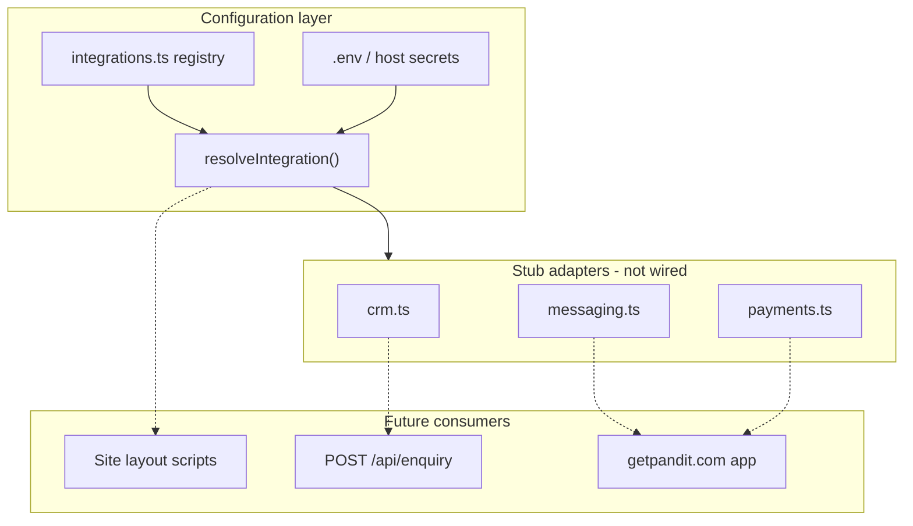

# Integrations Guide — Nexynth Labs Website

**Version:** 2.0  
**Last updated:** June 2026  
**Status:** Registry + stubs shipped; **analytics event plumbing** and **WhatsApp click-to-chat** readiness delivered. Production provider activation requires env IDs + consent policy.

This guide describes how to configure future third-party integrations for the Nexynth Labs corporate site (`nexynthlabs.com`) and documents which slots apply to the GetPandit product (`getpandit.com`).

---

## 1. Design principles

| Principle | Detail |
| --- | --- |
| **Config, not secrets** | Registry and types live in `src/config/integrations.ts`. API keys and IDs use environment variables only. |
| **Explicit activation** | Setting env vars moves a slot to `configured`. Providers run only when lifecycle is `active`. |
| **Scope separation** | Analytics/CRM target the corporate site. Payment/SMS/WhatsApp booking flows target GetPandit. |
| **Stub adapters** | `src/lib/integrations/*.ts` export typed placeholders that return safe no-op results until implemented. |
| **No scripts in phase 1** | GA, GTM, and Meta Pixel are **not** injected into `<head>` until adapters and consent policy are ready. |

---

## 2. Integration inventory

| ID | Label | Category | Scope | Phase | Default |
| --- | --- | --- | --- | --- | --- |
| `google-analytics` | Google Analytics (GA4) | Analytics | Corporate site | 3 | disabled |
| `google-tag-manager` | Google Tag Manager | Analytics | Corporate site | 3 | disabled |
| `meta-pixel` | Meta Pixel | Analytics | Corporate site | 3 | disabled |
| `linkedin-insight-tag` | LinkedIn Insight Tag | Analytics | Corporate site | 3 | disabled |
| `whatsapp-business` | WhatsApp Business | Messaging | Both | 4 | disabled |
| `sms-gateway` | SMS Gateway | Messaging | Both | 4 | disabled |
| `payment-gateway` | Payment Gateway | Commerce | GetPandit | 4 | disabled |
| `crm` | CRM Integration | CRM | Corporate site | 2 | disabled |

---

## 3. Lifecycle model

```
disabled ──(required env set)──► configured ──(STATUS=active)──► active
     ▲                                    │
     └──────── STATUS=disabled ───────────┘
```

| State | Meaning |
| --- | --- |
| `disabled` | Default. No env vars or incomplete required vars. |
| `configured` | Required env vars present; adapter not enabled or not built. |
| `active` | `INTEGRATIONS_<ID>_STATUS=active` **and** configuration complete. |

Override per integration:

```env
INTEGRATIONS_GOOGLE_ANALYTICS_STATUS=active
INTEGRATIONS_CRM_STATUS=configured
```

Valid values: `disabled` | `configured` | `active`.

---

## 4. Source layout

```
src/
├── types/
│   └── integrations.ts          # Shared TypeScript types
├── config/
│   └── integrations.ts          # Static registry (no secrets)
└── lib/
    └── integrations/
        ├── index.ts             # Public getters & runtime resolver
        ├── env.ts               # Env → ResolvedIntegration
        ├── crm.ts               # CRM sync stub (leads)
        ├── messaging.ts         # WhatsApp & SMS stubs
        └── payments.ts          # Payment session stub
```

### Runtime API (server)

```typescript
import {
  getIntegrationsRuntime,
  getIntegration,
  isIntegrationActive,
  isPublicAnalyticsReady,
} from "@/lib/integrations";

const ga = getIntegration("google-analytics");
// ga.lifecycle, ga.isConfigured, ga.isActive, ga.missingRequiredEnv

if (isPublicAnalyticsReady()) {
  // Future: mount ThirdPartyScripts in layout
}
```

---

## 5. Environment variables

Copy placeholders from `.env.example`. Summary by integration:

### 5.1 Google Analytics (GA4)

| Variable | Public | Required to configure |
| --- | --- | --- |
| `NEXT_PUBLIC_GA_MEASUREMENT_ID` | Yes | Yes |
| `GA_API_SECRET` | No | No (Measurement Protocol) |

### 5.2 Google Tag Manager

| Variable | Public | Required to configure |
| --- | --- | --- |
| `NEXT_PUBLIC_GTM_CONTAINER_ID` | Yes | Yes |

### 5.3 Meta Pixel

| Variable | Public | Required to configure |
| --- | --- | --- |
| `NEXT_PUBLIC_META_PIXEL_ID` | Yes | Yes |
| `META_CONVERSIONS_API_TOKEN` | No | No |

### 5.4 WhatsApp Business

| Variable | Public | Required to configure |
| --- | --- | --- |
| `INTEGRATIONS_WHATSAPP_PROVIDER` | No | No |
| `WHATSAPP_BUSINESS_PHONE` | No | No |
| `WHATSAPP_API_TOKEN` | No | No |
| `WHATSAPP_PHONE_NUMBER_ID` | No | No (Cloud API) |
| `NEXT_PUBLIC_WHATSAPP_CHAT_ENABLED` | Yes | No |

*Note: WhatsApp has no single required env key in the registry — set provider-specific vars and `INTEGRATIONS_WHATSAPP_BUSINESS_STATUS=active` when implementing.*

### 5.5 SMS Gateway

| Variable | Public | Required |
| --- | --- | --- |
| `INTEGRATIONS_SMS_PROVIDER` | No | No |
| `SMS_API_KEY` | No | No |
| `SMS_SENDER_ID` | No | No |
| `SMS_NOTIFY_ENABLED` | No | No |

### 5.6 Payment Gateway

| Variable | Public | Required |
| --- | --- | --- |
| `INTEGRATIONS_PAYMENT_PROVIDER` | No | No |
| `PAYMENT_KEY_ID` | No | No |
| `PAYMENT_KEY_SECRET` | No | No |
| `PAYMENT_WEBHOOK_SECRET` | No | No |
| `NEXT_PUBLIC_PAYMENT_KEY_ID` | Yes | No |

### 5.7 CRM

| Variable | Public | Required |
| --- | --- | --- |
| `INTEGRATIONS_CRM_PROVIDER` | No | No |
| `CRM_API_BASE_URL` | No | No |
| `CRM_API_KEY` | No | No |
| `CRM_PIPELINE_ID` | No | No |
| `CRM_SYNC_ENABLED` | No | No |

---

## 6. Supported providers (documentation only)

| Integration | Provider slugs |
| --- | --- |
| Google Analytics | `ga4` |
| Google Tag Manager | `gtm` |
| Meta Pixel | `meta-pixel` |
| WhatsApp | `whatsapp-cloud-api`, `twilio-whatsapp`, `gupshup-whatsapp` |
| SMS | `msg91`, `twilio-sms`, `gupshup-sms` |
| Payments | `razorpay`, `stripe`, `payu` |
| CRM | `hubspot`, `salesforce`, `zoho-crm`, `pipedrive`, `custom` |

Set via `INTEGRATIONS_<CHANNEL>_PROVIDER` env vars. Invalid slugs are ignored.

---

## 7. Wiring checklist (when implementing)

### 7.1 Public analytics (corporate site)

1. Complete cookie consent policy updates (`src/config/legal.ts`).
2. Create `src/components/integrations/ThirdPartyScripts.tsx`.
3. Guard with `isPublicAnalyticsReady()` or per-slot `isIntegrationActive()`.
4. Import in `src/app/(site)/layout.tsx` below JSON-LD script.
5. Prefer **GTM-only** if both GTM and GA4 are enabled — avoid duplicate page views.

### 7.2 CRM (corporate site leads)

1. Implement provider adapter in `src/lib/integrations/crm.ts`.
2. Call `syncLeadToCrm(lead)` from `src/app/api/enquiry/route.ts` after successful save.
3. Set `CRM_SYNC_ENABLED=true` and `INTEGRATIONS_CRM_STATUS=active`.

### 7.3 Messaging & payments (GetPandit)

1. Implement adapters in `messaging.ts` / `payments.ts` on the **product** repository.
2. Reuse the same env naming convention for operational consistency.
Corporate site may only expose WhatsApp click-to-chat when `NEXT_PUBLIC_WHATSAPP_CHAT_ENABLED` is not `false`. See **[WhatsApp Business Guide](./13-whatsapp-business-guide.md)**.

---

## 8. Architecture diagram



---

## 9. Privacy & compliance

- Update **Privacy Policy** and **Cookie Policy** before enabling analytics or Meta Pixel.
- Use `NEXT_PUBLIC_*` only for IDs that must load in the browser.
- Never commit `.env.local` or paste secrets into `src/config/`.
- DLT registration applies to SMS in India.
- Payment PCI scope stays on the product app with certified provider SDKs.

---

## 10. Verification (configuration only)

```bash
# Build must pass with all integrations disabled (default)
npm run lint
npm run build
```

Optional local smoke test after setting env:

```typescript
// Temporary script or node -e after importing compiled config
import { getIntegrationsRuntime } from "./src/lib/integrations";
console.log(JSON.stringify(getIntegrationsRuntime(), null, 2));
```

Expect all slots `lifecycle: "disabled"` or `configured` until `STATUS=active` is set.

---

## 11. Future integrations (not in registry yet)

These are documented in feature guides and `.env.example` placeholders — add to `integrations.ts` when implementing.

| Integration | Guide | Env / notes |
| --- | --- | --- |
| SMTP lead notifications | [14](./14-lead-crm-lite-guide.md) | `SMTP_*` |
| ESP (newsletter) | [36](./36-newsletter-guide.md) | Mailchimp / SendGrid API keys |
| Calendar booking | [24](./24-book-consultation-guide.md) | Calendly embed or Google Calendar API |
| Uptime / status | [20](./20-status-page-guide.md) | UptimeRobot, Better Stack, or custom probes |
| AI assistant | [42](./42-ai-assistant-placeholder-guide.md) | `OPENAI_API_KEY` or `GROQ_API_KEY` |
| CRM sync | [14](./14-lead-crm-lite-guide.md) | HubSpot / Salesforce via `integrations/crm.ts` |

**Production analytics:** Event names in `src/config/analytics.ts` — enable scripts only after cookie consent. See [15](./15-analytics-dashboard-guide.md).

---

## 12. Related documents

- [Environment Variables Guide](./06-environment-variables.md) — § Integrations
- [Architecture Document](./03-architecture.md) — § Integration architecture
- [Future Roadmap](./08-future-roadmap.md) — Phases 2–4
- [Architecture Diagram 6](./10-architecture-diagrams.md#6-future-whatsapp-sms-and-payment-flow) — GetPandit messaging and payment flow
