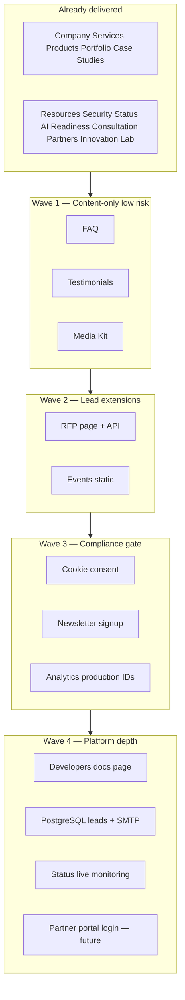

# Phase 3 Feature Roadmap — Nexynth Labs Website

**Document:** Master feature catalog, implementation checklist, and safe build sequence  
**Scope:** `nexynthlabs-website` corporate site only — **not** GetPandit product app  
**Last updated:** June 2026  
**Status:** Phase 3 public features **delivered** — Wave 4 backlog (analytics go-live, DB CMS, live status) tracked in §3.9+

---

## 1. Purpose

Single source of truth for **all** Nexynth Labs website feature areas: what is live today, what is planned next, dependencies, and the order in which work should ship without breaking master rules (mobile-first, config-driven, no public login, no GetPandit code changes).

---

## 2. Feature catalog

| # | Feature area | Primary routes (target) | Status | Config / guide |
| --- | --- | --- | --- | --- |
| 1 | **Company** | `/about`, `/company/founder`, `/company/leadership`, `/company/vision`, `/careers`, `/careers/culture`, `/roadmap` | **Delivered** | See [Company Pages Guide](./30-company-pages-guide.md) |
| 2 | **Services** | `/services` | **Delivered** | `services.ts` |
| 3 | **Products** | `/products`, `/products/ecosystem`, `/getpandit` | **Delivered** | `products.ts`, `product-ecosystem.ts` — [16](./16-product-ecosystem-guide.md) |
| 4 | **Innovation Lab** | `/innovation-lab` | **Delivered** | `innovation-lab.ts` — [26](./26-innovation-lab-guide.md) |
| 5 | **Portfolio** | `/portfolio` | **Delivered** | `portfolio.ts` |
| 6 | **Case Studies** | `/case-studies`, `/case-studies/[slug]` | **Delivered** | `portfolio.ts` — Phase 2 |
| 6b | **Client Success** | `/client-success` | **Delivered** | `client-success.ts` — [32](./32-client-success-guide.md) |
| 7 | **RFP** | `/request-proposal` | **Delivered** | `request-proposal.ts` — [33](./33-request-proposal-guide.md) |
| 8 | **Resources** | `/resources`, `/resources/[slug]`, `/guides`, `/guides/[slug]` | **Delivered** | `knowledge.ts`, `resource-downloads.ts` — [22](./22-knowledge-center-guide.md), [34](./34-resource-downloads-guide.md) |
| 9 | **Events** | `/events` | **Delivered** | `events.ts` — [35](./35-events-webinars-guide.md) |
| 10 | **Newsletter** | Footer + Home, Blog, Resources | **Delivered** | `newsletter.ts` — [36](./36-newsletter-guide.md) |
| 11 | **Testimonials** | Home + `/testimonials` | **Delivered** | `testimonials.ts` — [37](./37-testimonials-guide.md) |
| 12 | **FAQ** | `/faq` | **Delivered** | `faqs.ts` — [38](./38-faq-center-guide.md) |
| 13 | **Media Kit** | `/media-kit` | **Delivered** | `media-kit.ts` — [39](./39-media-kit-guide.md) |
| 14 | **Developers** | `/developers` | **Delivered** | `developers.ts` — [40](./40-developers-api-vision-guide.md) |
| 15 | **Security** | `/security`, `/trust` | **Delivered** | `security-trust.ts` — [21](./21-security-trust-center-guide.md) |
| 16 | **Status** | `/status` | **Delivered** (config placeholders) | `status-page.ts` — [20](./20-status-page-guide.md) |
| 17 | **AI Readiness** | `/ai-readiness-score` | **Delivered** | `ai-readiness-score.ts` — [23](./23-ai-readiness-score-guide.md) |
| 18 | **Consultation** | `/book-consultation` | **Delivered** | `book-consultation.ts` — [24](./24-book-consultation-guide.md) |
| 19 | **Partners** | `/partners`, `/partners/portal` | **Delivered** | `partners.ts`, `partner-portal.ts` — [25](./25-partner-portal-readiness-guide.md) |
| 20 | **Analytics** | Env-gated scripts + planned events | **Readiness delivered** | `analytics.ts` — [15](./15-analytics-dashboard-guide.md) |
| 21 | **Multilingual** | Language switcher (en / te / hi) | **Readiness delivered** | `i18n.ts`, `src/messages/` — [41](./41-multilingual-readiness-guide.md) |
| 22 | **AI Assistant** | Global widget + `/ai-showcase` section | **Placeholder delivered** | `ai-assistant.ts` — [42](./42-ai-assistant-placeholder-guide.md) |

### Supporting (not in headline list but shipped)

| Area | Routes | Status |
| --- | --- | --- |
| AI Showcase | `/ai-showcase` | Delivered |
| Technology | `/technology` | Delivered |
| Blog | `/blog`, `/blog/[slug]` | Delivered |
| Contact & leads | `/contact`, APIs | Delivered |
| Legal | `/privacy-policy`, `/terms`, `/cookie-policy`, `/disclaimer` | Delivered |
| Admin CMS shell | `/admin/login`, `/admin/*` | Staff-only; editors mostly future |

---

## 3. Planned feature definitions (not built yet)

### 3.1 RFP (`/request-proposal`) — delivered

**Route:** `/request-proposal` (redirect from `/rfp`)

| Item | Approach |
| --- | --- |
| Content | Config-driven process steps and form labels |
| Capture | `POST /api/request-proposal` → leads (`request_proposal` source) |
| Fallback | Mailto link on API error |
| Rules | No bid portal; email follow-up only |

See [Request Proposal Guide](./33-request-proposal-guide.md).

### 3.2 Events (`/events`) — delivered

See [Events & Webinars Guide](./35-events-webinars-guide.md). Config-driven sections with Upcoming, Planned, Completed labels. Enquiry-led registration.

### 3.3 Newsletter — delivered

Embedded signup on Home, Blog, Resources, and Footer. `POST /api/newsletter` → leads; mailto fallback. ESP integration TODO — see [Newsletter Guide](./36-newsletter-guide.md).

### 3.4 Testimonials — delivered

Home featured section + `/testimonials` with placeholder-only quotes. See [Testimonials Guide](./37-testimonials-guide.md).

### 3.5 FAQ — delivered

Searchable `/faq` with seven categories and FAQPage JSON-LD. See [FAQ Center Guide](./38-faq-center-guide.md).

### 3.6 Media Kit (`/media-kit`) — delivered

**Route:** `/media-kit` (redirect from `/press`)

| Item | Approach |
| --- | --- |
| Assets | `public/press/` + on-screen previews from `public/branding/logo/` |
| Content | Config in `media-kit.ts`; boilerplate copy with clipboard button |
| Contact | Press mailto + `/contact?intent=press` |

See [Media Kit Guide](./39-media-kit-guide.md).

### 3.7 Developers (`/developers`) — delivered

**Goal:** API/integration overview for technology partners (not full developer portal).

| Item | Approach |
| --- | --- |
| Content | Config sections: API vision, coming-soon APIs, GetPandit integrations, webhooks, documentation |
| Rules | Honest “documentation in progress”; no fake API keys on site |
| Link | Knowledge nav; related links to Technology, Partners, Innovation Lab |

See [Developers / API Vision Guide](./40-developers-api-vision-guide.md).

### 3.8 Analytics readiness — delivered

**Goal:** Env-gated scripts and safe no-op event plumbing before production go-live.

| Item | Approach |
| --- | --- |
| Providers | GA4, GTM, Meta Pixel, LinkedIn — `NEXT_PUBLIC_*` in `.env.example` |
| Utility | `trackPlannedEvent()` in `src/lib/analytics/track-client.ts` |
| Events | `contact_form_submit`, `rfp_submit`, `partner_submit`, `getpandit_cta_click`, `whatsapp_cta_click`, `consultation_submit`, `resource_download_click` |
| Production | Requires cookie consent + env IDs — see [15](./15-analytics-dashboard-guide.md) |

### 3.9 Status (live monitoring) — planned

**Goal:** Replace config placeholders with real probes.

| Item | Approach |
| --- | --- |
| Prereq | Uptime provider or custom health checks |
| Scope | Corporate site + getpandit.com **status display only** — no product code changes |

### 3.10 Multilingual — readiness delivered

**Goal:** Locale infrastructure without full translated content.

| Item | Approach |
| --- | --- |
| UI | Language switcher (en / te / hi); shell strings in `src/messages/` |
| Content | Marketing copy remains English until translation workflow |
| Future | `app/[locale]/` + `hreflang` — see [41](./41-multilingual-readiness-guide.md) |

### 3.11 AI Assistant — placeholder delivered

**Goal:** “Ask Nexynth AI” widget with honest coming-soon UX.

| Item | Approach |
| --- | --- |
| UI | Floating widget + panel; disabled input; topic deep links |
| API | None — `POST /api/ai-assistant` future with OpenAI/Groq env |
| Rules | No fake chat; guardrails doc in [42](./42-ai-assistant-placeholder-guide.md) |

### 3.12 Production analytics — planned

Enable third-party tags only after cookie consent + env IDs. Event plumbing already ships via `trackPlannedEvent()`.

---

## 4. Implementation checklist

Use this checklist per feature before marking **Done**.

### 4.1 Planning

- [ ] Feature scoped in this document (§3)
- [ ] Route(s) confirmed; no conflict with GetPandit product routes
- [ ] Config file name agreed (`src/config/<feature>.ts`)
- [ ] Lead source / API pattern chosen (if applicable)
- [ ] Honesty review — no false compliance, metrics, or “live” labels

### 4.2 Build

- [ ] Page(s) under `src/app/(site)/`
- [ ] Reusable components under `src/components/<feature>/`
- [ ] Types under `src/types/` if non-trivial
- [ ] Mobile-first layout (`min-h-11`, responsive grids)
- [ ] No public login or visitor accounts

### 4.3 Discovery

- [ ] `siteConfig.seo.pages` entry
- [ ] `PAGE_PATHS` in `src/lib/seo.ts`
- [ ] `sitemap.ts` static route(s)
- [ ] Nav and/or footer link (if user-facing)
- [ ] `createPageMetadataFromKey` or `generateMetadata` on page

### 4.4 Leads & integrations (if applicable)

- [ ] API route or reuse `/api/enquiry` with source tag
- [ ] `LeadSource` + `normalize.ts` + `leads-crm.ts` labels
- [ ] `trackPlannedEvent` entry in `analytics.ts` (optional until go-live)
- [ ] Integration TODO documented if backend not wired

### 4.5 Documentation

- [ ] Feature guide `docs/nexynth-labs/NN-<feature>-guide.md`
- [ ] Row in [README](./README.md) index
- [ ] §5.4.x in [Functional Specification](./01-functional-specification.md)
- [ ] This document §2 status → **Delivered**
- [ ] [08-future-roadmap.md](./08-future-roadmap.md) updated

### 4.6 QA

- [ ] `npm run lint`
- [ ] `npm run build`
- [ ] Manual mobile spot-check (360–430px)
- [ ] `node scripts/phase3-qa-check.mjs` (extend routes when added)

---

## 5. Safe implementation sequence

Ship in this order to minimize rework and respect dependencies. **Do not skip foundation** if production lead volume or compliance matters.

### Wave 0 — Complete ✅

Public Phase 3 marketing features (see [28-phase-3-final-qa-report.md](./28-phase-3-final-qa-report.md)).

### Wave 1 — Content expansion (next safe builds)

| Order | Feature | Why first |
| --- | --- | --- |
| 1.1 | **FAQ** | Pure config; no API; improves SEO and support |
| 1.2 | **Testimonials** | Config + home section; no backend |
| 1.3 | **Media Kit** | **Delivered** — `/media-kit`, config + placeholders |

**Exit criteria:** 3 routes live, sitemap + SEO, no new APIs required.

### Wave 2 — Lead & calendar surfaces

| Order | Feature | Why |
| --- | --- | --- |
| 2.1 | **RFP** | Reuses lead pipeline; sales-critical |
| 2.2 | **Events** | Config list; optional enquiry CTA |
| 2.3 | **Consultation** enhancements | Calendly embed **after** Wave 3 consent (optional) |

**Exit criteria:** New lead sources documented; file storage OK for staging.

### Wave 3 — Consent & measurement

| Order | Feature | Why |
| --- | --- | --- |
| 3.1 | **Cookie consent** | Legal prerequisite |
| 3.2 | **Newsletter** | Requires consent + third-party or API |
| 3.3 | **Analytics** production | Only after 3.1 |

**Exit criteria:** Cookie policy aligned; tags fire only after opt-in.

### Wave 4 — Operations & platform

| Order | Feature | Why |
| --- | --- | --- |
| 4.1 | **PostgreSQL + SMTP** | Production leads & notifications |
| 4.2 | **Developers** | **Delivered** — `/developers` vision page; no live API |
| 4.3 | **Status monitoring** | Ops maturity |
| 4.4 | **CMS editors** | FAQs, testimonials, events CRUD |
| 4.5 | **Partner portal login** | Last — highest scope |

---

## 6. Explicit non-goals (every wave)

| Non-goal | Reason |
| --- | --- |
| GetPandit booking/payment/auth in this repo | Product domain `getpandit.com` |
| Public visitor login | Master rule |
| Fake metrics, certifications, live monitoring claims | Trust |
| ATS / full partner portal v1 | Backend not ready |
| Headless CMS migration | Phase 5 optional |

---

## 7. Prompt-to-feature mapping (Phase 3 history)

| Prompt theme | Feature area | Doc |
| --- | --- | --- |
| Product ecosystem | Products | [16](./16-product-ecosystem-guide.md) |
| Founder story | Company | [17](./17-founder-story-guide.md) |
| Technology excellence | Company / Services adjacency | [18](./18-technology-excellence-guide.md) |
| Public roadmap | Company | [19](./19-public-roadmap-guide.md) |
| Status | Status | [20](./20-status-page-guide.md) |
| Security & trust | Security | [21](./21-security-trust-center-guide.md) |
| Knowledge center | Resources | [22](./22-knowledge-center-guide.md) |
| AI Readiness Score | AI Readiness | [23](./23-ai-readiness-score-guide.md) |
| Book consultation | Consultation | [24](./24-book-consultation-guide.md) |
| Partner portal readiness | Partners | [25](./25-partner-portal-readiness-guide.md) |
| Innovation Lab | Innovation Lab | [26](./26-innovation-lab-guide.md) |
| Careers + culture | Company | [27](./27-careers-culture-guide.md) |
| Final QA | All delivered | [28](./28-phase-3-final-qa-report.md) |
| **This doc** | Full catalog + future waves | **29** (this file) |

---

## 8. How to use this roadmap

1. Pick the next feature from **§5 Safe implementation sequence** (start Wave 1 unless infra is urgent).
2. Complete **§4 Implementation checklist** for that feature only.
3. Update **§2 Feature catalog** status column.
4. Do not implement multiple lead APIs without updating CRM normalize + docs.

---

## Related

- [Future Roadmap](./08-future-roadmap.md) — phase timeline & CMS backend
- [Functional Specification](./01-functional-specification.md) — requirements IDs
- [Master rules](../../README.md#master-rules-every-prompt)
