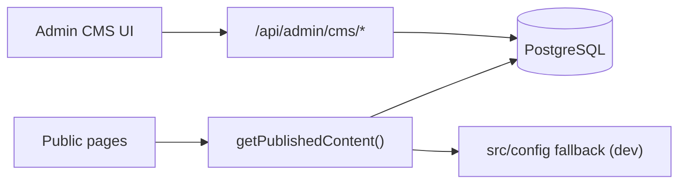

# Admin & CMS — Future Guide

**Current state:** Staff-only admin shell at `/admin/*` with read-only module previews and a **working leads inbox**  
**Future state:** Database-backed content editing, publish workflow, and hardened auth  
**Last updated:** June 2026

---

## 1. What exists today (Phase 3)

| Capability | Status |
| --- | --- |
| `/admin/login` | Shared password + HMAC session cookie |
| Role matrix | `SUPER_ADMIN`, `ADMIN`, `MARKETING_ADMIN`, `SALES_ADMIN` |
| Module previews | Config read-only views per `src/config/cms.ts` |
| Leads inbox | List, status update, export (`SUPER_ADMIN`, `SALES_ADMIN`) |
| Public content | Edited via `src/config/*.ts` in Git — not in-browser |

See [Admin User Guide](./04-admin-user-guide.md).

---

## 2. What is not built

- Database persistence for users, content revisions, or leads
- WYSIWYG / MDX blog editor
- Draft vs published workflow
- In-browser SEO editor with OG upload
- User management UI (create/disable staff)
- SSO (Google Workspace)
- Audit log
- Automated rebuild on publish

---

## 3. Target architecture (Phase 4+)



**Principles:**

1. Public site reads **published** content from DB at request time or via ISR.
2. `src/config/*` remains fallback for local dev without `DATABASE_URL`.
3. Every write checks `requireModuleAccess(moduleId, "write")`.
4. No public signup or self-service admin creation.

---

## 4. Database schema (proposed)

| Table | Purpose |
| --- | --- |
| `cms_users` | email, role, password_hash, active, last_login |
| `cms_revisions` | module, document JSON, status (`draft` \| `published`), author, timestamps |
| `cms_leads` | All lead fields + status + assigned_to (migrate from `leads.json`) |
| `cms_audit_log` | SUPER_ADMIN actions (optional v2) |

**ORM:** Prisma or Drizzle — team choice at implementation.

**Env:** `DATABASE_URL` — see [Environment Variables](./06-environment-variables.md).

---

## 5. Module editor backlog

| Priority | Module | Editor scope |
| --- | --- | --- |
| P1 | **Leads** | Already partial — migrate to DB, assignment, notes |
| P1 | **Company profile** | `site-values`, nav labels, contact block |
| P2 | **Blog** | MDX/rich text, draft/publish, slug |
| P2 | **SEO** | Per-page title/description, OG image upload |
| P3 | **Services** | CRUD + reorder |
| P3 | **Products** | CRUD; validate external URLs |
| P3 | **FAQs** | CRUD — sync to `faqs.ts` or DB-only |
| P3 | **Testimonials** | Approval workflow; hide `draft` |
| P3 | **Careers** | Job opening CRUD |
| P4 | **Events** | Section cards + status |
| P4 | **Resources** | Knowledge articles + download `available` flag |
| P4 | **Roadmap / Status** | Milestone and service health editors |

Config modules already mapped in `src/config/cms.ts` → extend with write APIs.

---

## 6. Auth hardening

| Item | Requirement |
| --- | --- |
| Password storage | Bcrypt or Argon2 — never plain `ADMIN_PASSWORD` in production |
| Session | Rotate `ADMIN_SESSION_SECRET`; consider shorter TTL |
| Rate limit | `/api/admin/login` — per IP |
| SSO | Optional Google Workspace for `@nexynthlabs.com` |
| User admin | `/admin/users` — SUPER_ADMIN only |

---

## 7. Publish pipeline

| Step | Mechanism |
| --- | --- |
| Draft save | `cms_revisions.status = draft` |
| Preview | Admin-only token URL or preview mode |
| Publish | Flip to `published`; trigger rebuild |
| Rebuild | `CMS_WEBHOOK_REBUILD_URL` or Next.js `revalidateTag` |

**Content status types:** See `src/types/content.ts` (`ContentStatus`).

---

## 8. API conventions (future)

```
POST   /api/admin/cms/{module}        # create draft
PATCH  /api/admin/cms/{module}/{id}  # update draft
POST   /api/admin/cms/{module}/{id}/publish
GET    /api/admin/cms/{module}        # list revisions
```

Every mutating route:

```typescript
const { session } = await requireModuleAccess(moduleId, "write");
```

**Role rules:**

- `SALES_ADMIN` — leads write; no SEO write
- `MARKETING_ADMIN` — marketing modules; no lead delete
- `ADMIN` — read-all; limited write per matrix
- `SUPER_ADMIN` — full access + users

---

## 9. Migration plan

1. Add PostgreSQL + schema migrations
2. Dual-write leads: file + DB → verify parity
3. Switch `POST /api/enquiry` (and other lead APIs) to DB insert
4. Migrate existing `data/leads.json` via one-time script
5. Ship blog + SEO editors (marketing unblock)
6. Gradually replace static config imports with `getPublishedContent()`
7. Deprecate file backend behind feature flag

---

## 10. Security reminders

- Admin routes excluded from `sitemap.xml` ✓
- `robots: noindex` on `/admin/*` ✓
- No public CMS signup endpoint
- Audit log for publish and user changes
- Secrets only in host env — never in `src/config`

---

## 11. Related documents

- [Admin User Guide](./04-admin-user-guide.md) — current usage
- [Architecture Diagram 5 — Future CMS flow](./10-architecture-diagrams.md#5-future-cms-flow)
- [Lead CRM Lite Guide](./14-lead-crm-lite-guide.md)
- [Technical Specification](./02-technical-specification.md) — auth & API
- Legacy backlog: [../cms-todo.md](../cms-todo.md) (consolidated here)
